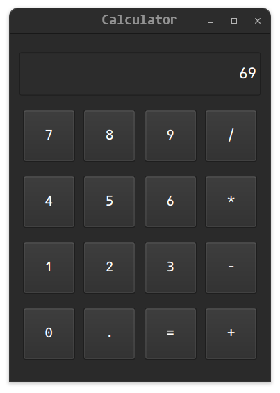

# PySide6 Calculator

This is a simple calculator application built using PySide6 for the GUI. The calculator supports basic arithmetic operations.

## Features

- Addition, subtraction, multiplication, and division.
- Real-time display update.
- Error handling for invalid inputs.

## Prerequisites

Ensure you have Python installed on your system. You will also need to install PySide6. You can install it using pip:

```bash
pip install PySide6
```

## Screenshots


